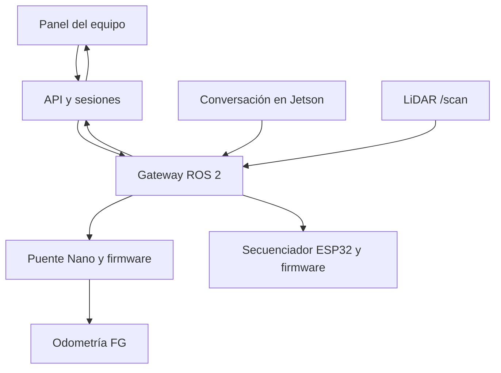

# Arquitectura V5

## Flujo de control



Los navegadores comparten estado y datos de equipo. Cada pestaña tiene un ID aleatorio y cada sesión un token revocable, almacenado como hash. Solo una combinación sesión/pestaña posee la concesión de control. Las tareas usan versión optimista: una actualización concurrente devuelve 409 y obliga a recargar el registro.

La API cuenta con dos adaptadores: `simulation`, sin ROS ni puertos; y `ros2`, que llama al servicio de la Raspberry. El gateway también puede operar como `ros2-simulation`, con mensajes ROS reales y actuadores simulados. Esto no sustituye una simulación de dinámica, SLAM ni Gazebo.

## Permisos

| Operación | Administrador | Ingeniero | Docente | Observador |
|---|---|---|---|---|
| Ver estado y cámara | Sí | Sí | Sí | Sí |
| Detener/enclavar parada | Sí | Sí | Sí | Sí |
| Tomar control, base, brazos, voz, rearme | Sí | Sí | No | No |
| Crear tareas y notas | Sí | Sí | Sí | No |
| Consultar bitácora de acciones | Sí | Sí | No | No |
| Crear cuentas | Sí | No | No | No |

## Contratos

| Canal | Tipo | Uso |
|---|---|---|
| `/maxcim/execute_command` | `maxcim_interfaces/srv/ExecuteCommand` | Orden con owner, command y payload JSON; respuesta aceptada/rechazada y estado |
| `/maxcim/state` | `maxcim_interfaces/msg/RobotState` | KEEP_LAST(1), TRANSIENT_LOCAL; consignas, modo, parada y secuencia |
| `/maxcim/base/cmd_vel` | `geometry_msgs/msg/Twist` | Entrada V5 exclusiva del puente Nano; no suscribir la base a Nav2 directamente |
| `/wheel_feedback` | `maxcim_interfaces/msg/WheelFeedback` | Pulsos FG reales y estado del Nano, no pulsos derivados de una consigna |
| `/nano_base/status` | `std_msgs/msg/String` JSON | Identidad, habilitación y motivo del puente |
| `/scan` | `sensor_msgs/msg/LaserScan` | Percepción de obstáculos |
| `/maxcim/arms/request` | `std_msgs/msg/String` JSON | Gesto del catálogo o STOP, con ID de petición |
| `/maxcim/arms/state` | `std_msgs/msg/String` JSON | Habilitación, ocupación, ID atendido y motivo; sin posición medida |
| `/maxcim/voice_action` | `ExecuteCommand` | Solo `arm`/`stop` con permiso de voz y concesión vigentes |
| `/camera/image_raw/compressed` | `sensor_msgs/msg/CompressedImage` | JPEG reciente para la consola y conversación |
| `/audio/raw` | `std_msgs/msg/UInt8MultiArray` | Audio del micrófono; presencia no implica reconocimiento correcto |

`POST /api/robot/command` exige cookie de sesión, `X-CSRF-Token` y `X-Control-Client`. Ejemplo:

```json
{"command":"drive","payload":{"seq":1,"linear":0.10,"angular":0.0}}
```

`brake` usa la misma secuencia creciente; por ello una orden anterior llegada después del frenado se rechaza. `stop` revoca la concesión y `estop` además enclava la parada. El navegador nunca reintenta una orden de movimiento tras un timeout. Un timeout no equivale a confirmar que la orden no se ejecutó: se consulta el estado y vence el watchdog.

## Plazos y límites iniciales

- Gateway: consigna 350 ms, concesión 2 s, LiDAR 500 ms; tick monotónico cada 20 ms.
- Puente Nano: cmd_vel 300 ms y feedback 250 ms; Nano físico 350 ms.
- ESP32 V5: PING cada 100 ms, vencimiento 350 ms; se mantiene el último PWM mandado.
- Consola: heartbeat 700 ms; movimiento a 10 Hz mientras se mantiene pulsado, sin cola de solicitudes.
- Límite del gateway: 0.20 m/s y 0.40 rad/s. El Nano limita por rueda a su configuración, inicialmente 0.10 m/s.
- LiDAR: mínimo de 80% de rayos válidos. `+inf` significa sin retorno hasta range_max; datos malformados invalidan la lectura. Margen inicial conservador 0.45 m en todas las direcciones.

Estos límites son configuraciones, no mediciones de rendimiento ni garantía de frenado. El margen LiDAR no incorpora todavía una envolvente calibrada de los brazos. No ejecutar gestos mientras la base se mueve.

ROS/DDS se mantiene en una red de dispositivos autorizados. Los roles HTTP no autentican participantes DDS externos. Una red no confiable exige enclaves SROS2; no exponer servicios ROS a Internet. Los motores solo escuchan el topic V5 remapeado, pero un participante autorizado en DDS sigue teniendo acceso al robot.

## Voz y percepción

La herramienta `hacer_gesto` del nodo de conversación solicita gestos por el servicio ROS; no accede a serie, no adquiere control ni rearma una parada. El operador debe activar **Permitir gestos por voz**. El nombre del gesto se valida antes de ejecutar. La selección del modelo y sus credenciales permanecen en el nodo original; el control local y el panel no dependen del proveedor de IA.

Las imágenes de la consola son instantáneas JPEG autenticadas, de máximo 2 MB y antigüedad menor a 1 s, renovadas aproximadamente a 2 Hz. No constituyen un sistema de vídeo de baja latencia certificado para conducción a distancia.
